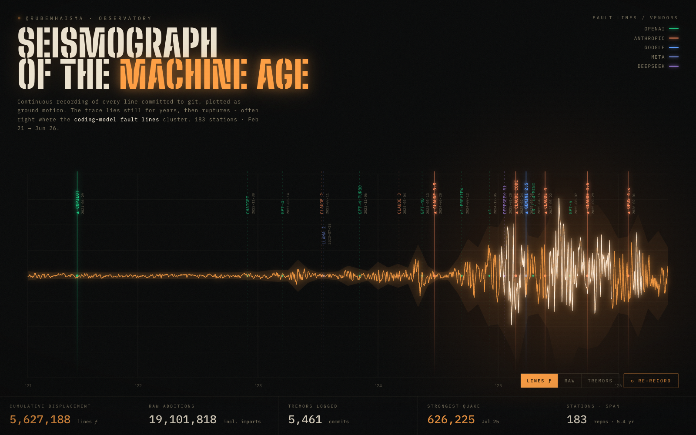

# gitquake

Your GitHub history as a **seismograph**. Lines of code per month are the ground
motion; major AI model releases are the fault lines running through it. The trace
lies near-flat for years, then ruptures — often right where the coding-model fault
lines cluster.



## Quickstart

One file, no dependencies. You need Python 3.8+ and the [GitHub CLI](https://cli.github.com/).

```bash
gh auth login
python3 seismograph.py --open
```

That builds `seismograph.html` for the logged-in user and opens it. Chart anyone:

```bash
python3 seismograph.py --user torvalds --open
```

No `gh`? Set a token instead: `export GITHUB_TOKEN=ghp_…`

## Drop it in an agent

Point any coding agent at this repo and say:

> Build me a gitquake seismograph for GitHub user `<name>`.

It has everything it needs — see [`AGENTS.md`](AGENTS.md). One stdlib-only script,
one command, a self-contained HTML file out the other end.

## How it works

- Pulls your per-month **additions** and **commits** from GitHub's
  `stats/contributors` API across every repo you commit to (public + private if you own them).
- Drops **bulk-import repos** (>10k additions per commit — vendored deps, datasets,
  generated files) so the trace reflects code you wrote, not code you pasted.
- Inlines the data and a curated AI-model-release timeline into a single animated
  HTML file. The seismograph pen draws itself on load; toggle **Lines / Raw / Tremors**.
- Caches each repo's stats by last-push, so the first run takes a few minutes (it is
  almost entirely network wait) but every re-run finishes in seconds. `--no-cache`
  forces a full refresh.

## Honest caveats

- "Lines" is GitHub's additions count — a measure of activity, not artistry. The
  **Raw** channel keeps the bulk imports if you want the unfiltered truth.
- Model release dates are curated (`EVENTS` in `seismograph.py`); the most recent
  ones are approximate. Edit them freely.
- Correlation, not causation. The chart shows your output rose alongside the
  coding-model era. It can't prove one caused the other.

## License

MIT — see [LICENSE](LICENSE).
